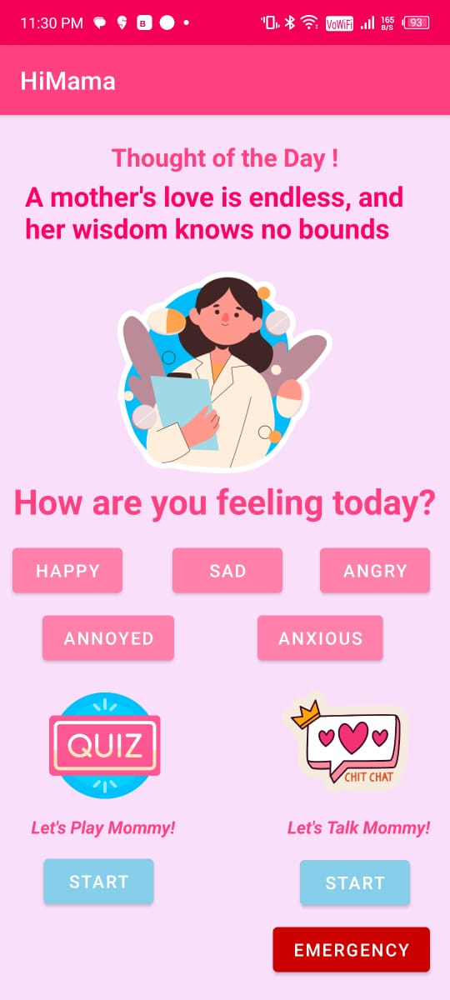
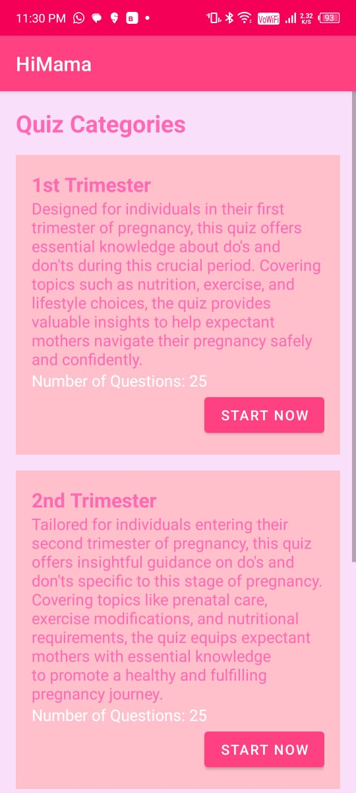
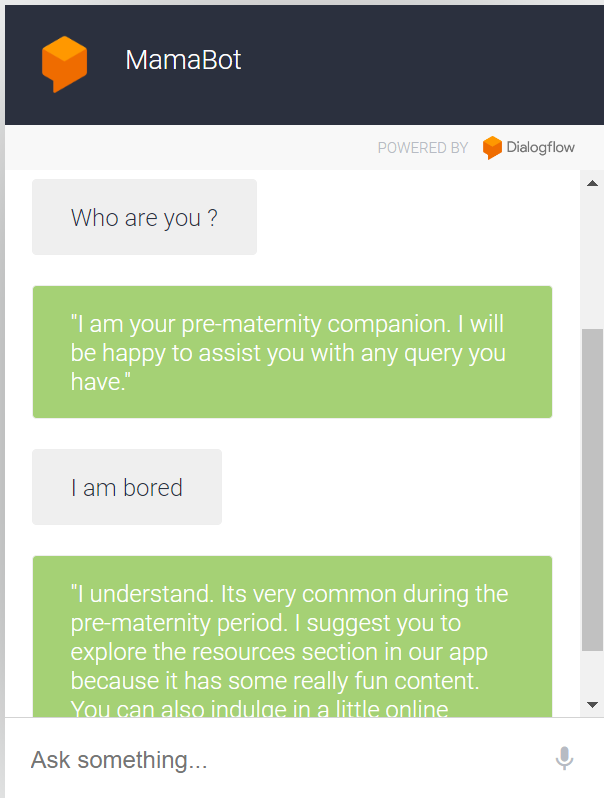

# HiMama Maternity Health Awareness App
Hey there! Welcome to HiMama, the app, for moms to be to stay on top of their maternity health journey. With HiMama you'll find everything you need to track your well being and your babys health during pregnancy.

## Sneak Peek Inside the App

Take a look at these snapshots from HiMama;

Explore a range of articles and resources covering topics like pregnancy health, nutrition, fitness and more.

Discover curated videos and articles based on your mood selection.

Prepares the expectant mother with pregnancy do's and dont's and knowledge related to pregnancy symptops/complications in a fun interactive way. 

Access an emergency phonebook directly through the app. Send out SOS alerts to your contacts in case of emergencies, for quick help.

Designed to support expectant mothers throughout their maternity journey, our chatbot is here to provide personalized assistance, answer questions, and offer guidance on pregnancy-related topics.

## Key Features

### 1. Pregnancy Mood Monitor:
 Monitor and record your mood during your pregnancy experience.
 Get customized content, like videos and articles that match your mood.
 ### 2. Quiz Section
- Engage in quizzes tailored for each trimester of pregnancy.
- Test your knowledge and learn new information about pregnancy and childbirth.

### 3. Emergency Phonebook & SOS
- Access an emergency phonebook within the app.
- Send SOS alerts to close contacts during emergencies, ensuring quick assistance.

### 4. Chatbot 
 - Offer personalized advice, answer common questions, and provide reassurance throughout the maternity journey. 
- Serve as a virtual companion, enhancing the overall user experience with the HiMama app.

## Installation

To run the HiMama app on your Android device, follow these steps:

- Clone this repository to your local machine using Git:
  
   git clone https://github.com/shinjini1202/Hi_Mama_GSC2024.git
  
- Open the project in Android Studio.

- Connect your Android device to your computer via USB.

- Build and run the app on your device.
